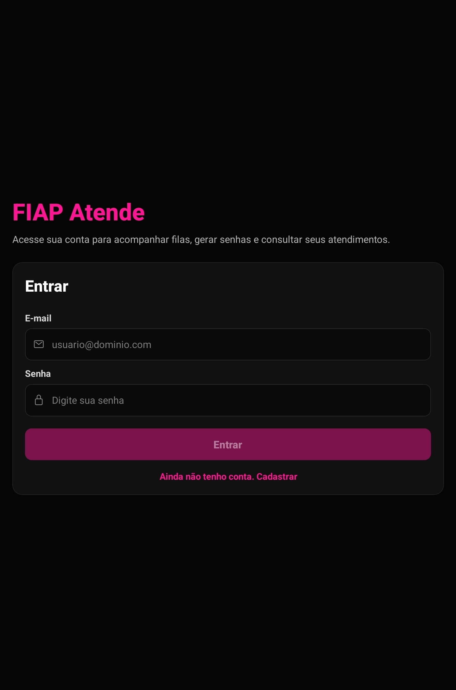
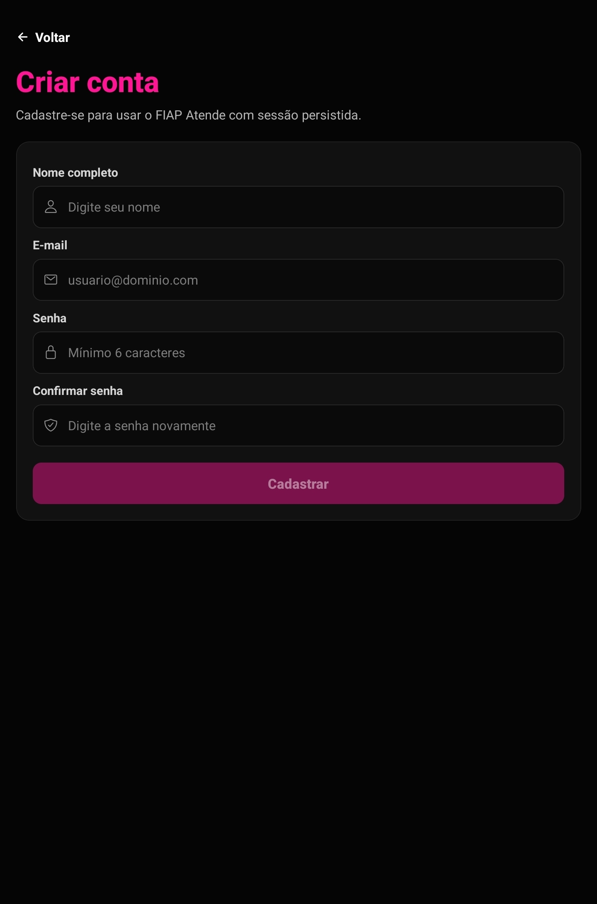
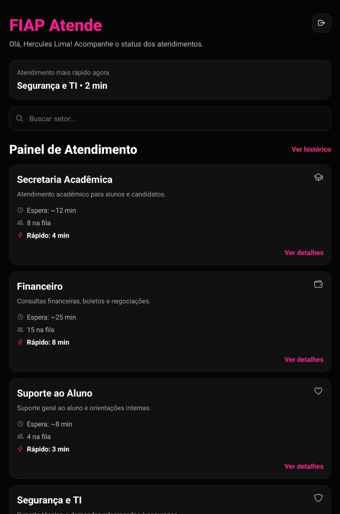
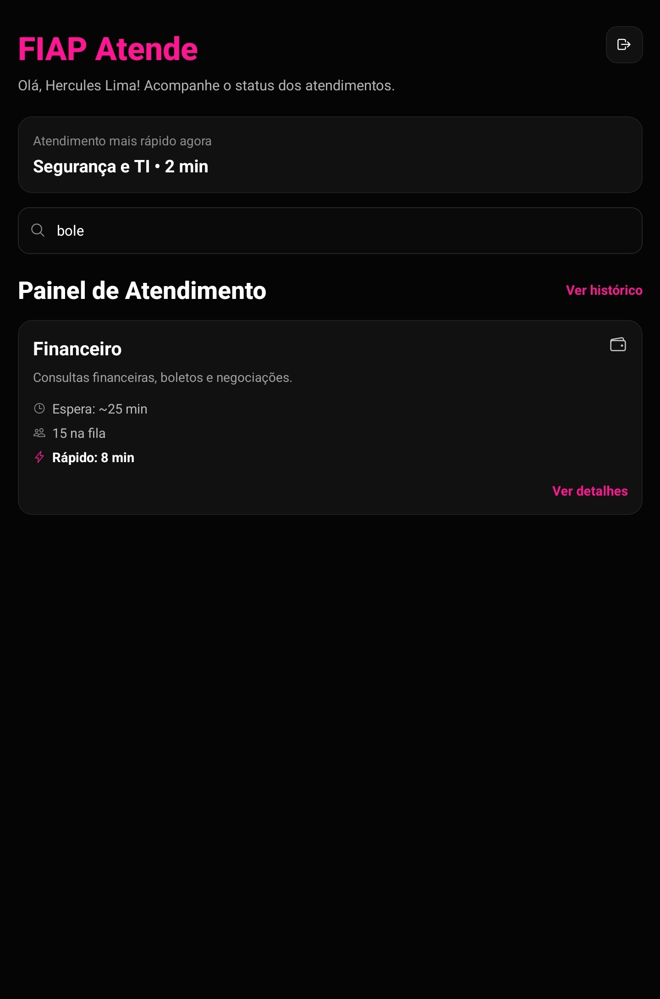
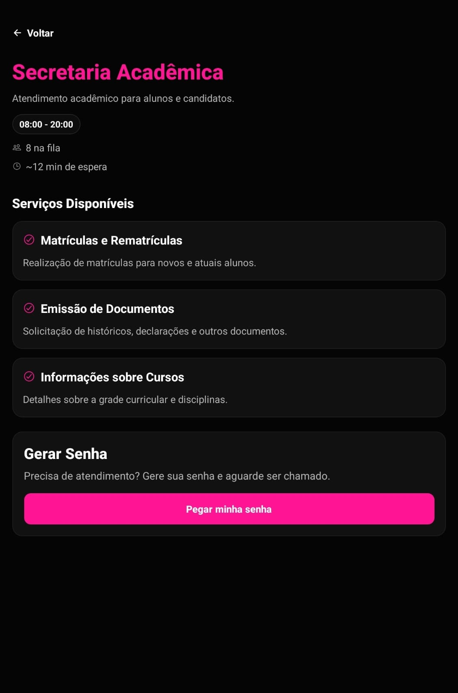
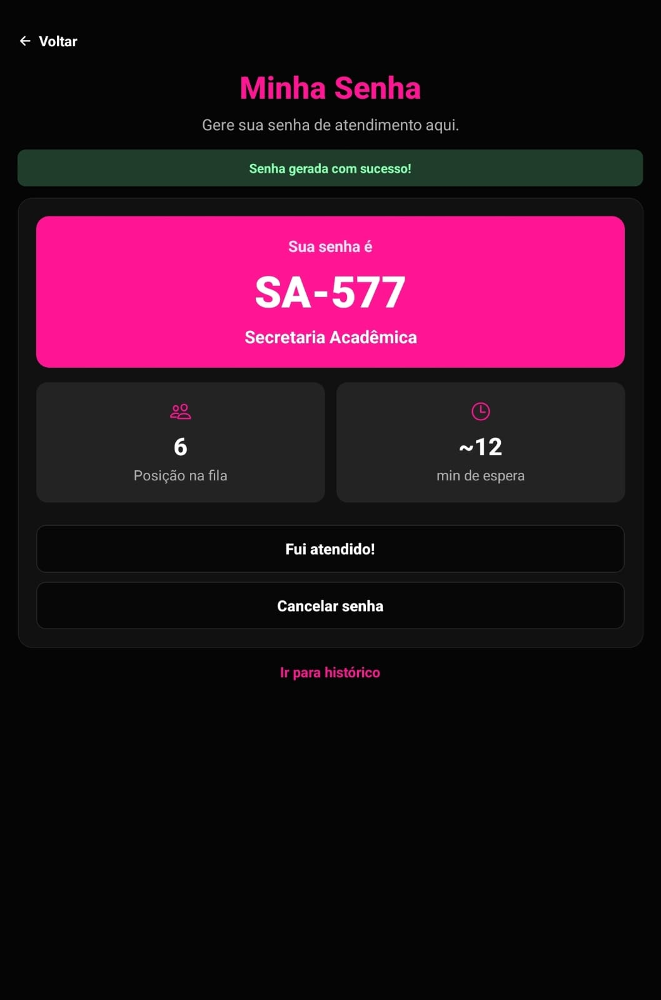
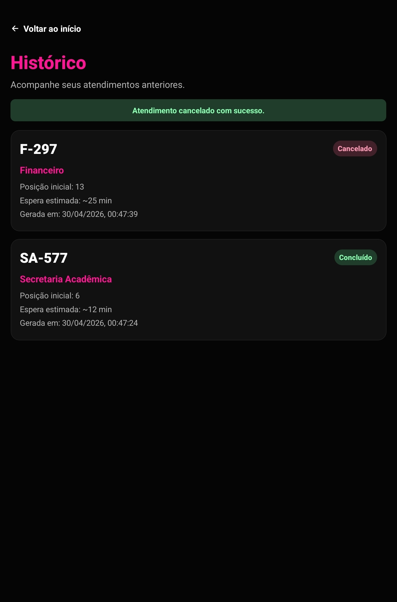
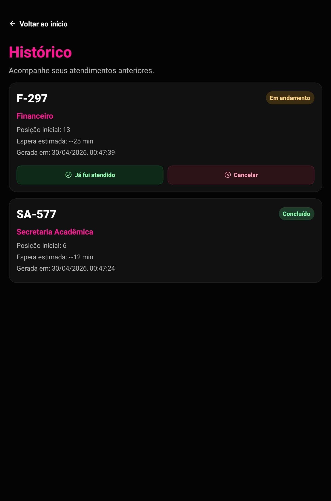

# FIAP Atende

Aplicativo mobile desenvolvido em **React Native com Expo** que simula um sistema de gerenciamento de filas e atendimento para alunos da FIAP.

O objetivo do aplicativo é permitir que estudantes acompanhem o tempo de espera, visualizem os setores disponíveis, gerem uma senha de atendimento e gerenciem seu atendimento diretamente pelo celular, evitando filas físicas e melhorando a experiência dentro da instituição.

---

# Sobre o Projeto

O **FIAP Atende** foi criado para resolver um problema comum em ambientes acadêmicos: a dificuldade de organização e acompanhamento das filas de atendimento em setores administrativos.

O projeto foi inspirado em situações reais do **Help Center da FIAP**, onde há grande demanda por atendimentos acadêmicos, financeiros e técnicos.

---

## Operação da FIAP escolhida

A operação escolhida foi **Atendimento ao Aluno**, pois concentra grande parte das interações com estudantes, como:

- matrícula e rematrícula  
- emissão de documentos  
- suporte financeiro  
- suporte acadêmico  
- suporte técnico  

O aplicativo busca **otimizar o fluxo de atendimento**, trazendo mais organização e transparência.

---

## Evolução do Projeto (CP1 → CP2)

Nesta versão (CP2), o projeto evoluiu significativamente em relação ao CP1:

- Implementação de **autenticação completa** (cadastro, login e logout)
- Criação de **AuthContext** para gerenciamento de usuário
- Adição de **barra de busca** na home
- Implementação de **validação de formulário**
- Inclusão de ações de atendimento:
  - finalizar atendimento ("Fui atendido")
  - cancelar senha
- Melhorias na experiência do usuário (UI/UX)
- Melhor organização do código

---

# Funcionalidades Implementadas

## Autenticação
- Criação de conta (cadastro)
- Login com validação de campos
- Logout com redirecionamento
- Gerenciamento de usuário com contexto global

## Home (Dashboard)
- Saudação personalizada
- Lista de setores disponíveis
- Destaque do atendimento mais rápido
- Barra de busca para filtrar setores
- Acesso ao histórico

## Detalhes do Setor
- Serviços disponíveis
- Tempo médio de espera
- Pessoas na fila

## Senha
- Geração de senha
- Código único
- Posição na fila
- Tempo estimado de espera

## Gerenciamento de Atendimento
- Botão **"Fui atendido"**
- Botão **"Cancelar senha"**

## Histórico
- Lista de atendimentos
- Status (finalizado/cancelado)

---

# Demonstração Visual (OBRIGATÓRIO)

## Prints das Telas

| Login | Cadastro | Home |
|-------|----------|------|
|  |  |  |

| Busca | Detalhes | Gerar Senha |
|-------|----------|-------------|
|  |  |  |

| Minha Senha | Histórico | Ações |
|-------------|-----------|--------|
|  |  |  |

---

## Vídeo do fluxo completo

Demonstra:

- cadastro  
- login  
- uso do app  
- busca  
- geração de senha  
- finalização/cancelamento  
- logout  

🔗 https://youtube.com/shorts/esi-57Oy28E

---

# Integrantes do Grupo

- Giovanna Fernandes Pereira — RM: 565434  
- João Pedro de Moura Albino — RM: 565323  
- Kauê Silva Matheus — RM: 561675  

---

# Repositório do Projeto

https://github.com/jalbino0/fiap-cpad-cp2-FIAP-Atende.git

---

# Como Rodar o Projeto

## Pré-requisitos

- Node.js  
- npm ou yarn  
- Expo CLI  
- Expo Go  
- Expo SDK (versão utilizada no projeto)

---

## Passo a passo

```bash
git clone https://github.com/jalbino0/fiap-cpad-cp2-FIAP-Atende.git
cd fiap-cpad-cp2-FIAP-Atende
npm install
npx expo install @react-native-async-storage/async-storage
npx expo start
```

## Depois

- escaneie o QR Code no Expo Go  
- ou utilize emulador Android/iOS  

---

# Decisões Técnicas

## Estrutura do Projeto
- app/ → telas  
- components/ → componentes reutilizáveis  
- context/ → gerenciamento global  
- data/ → dados simulados  

## Autenticação
Implementada com **AuthContext**, responsável por:
- login  
- cadastro  
- logout  
- controle do usuário  

## Gerenciamento de Estado

### AuthContext
- usuário logado  

### AtendimentoContext
- senha atual  
- histórico  
- geração, cancelamento e finalização  

## Persistência
Utilização de **AsyncStorage** para:
- armazenar dados do usuário  
- manter sessão ativa  

## Navegação Protegida
- acesso restrito às telas internas  
- redirecionamento automático para login  

---

# Diferencial Implementado (OBRIGATÓRIO)

## Barra de Busca de Setores

### Justificativa
Melhora a experiência do usuário, permitindo encontrar rapidamente setores e serviços.

### Implementação
- useState para controle da busca  
- useMemo para otimização  
- filtro por nome e descrição  

---

# Próximos Passos
- integração com API real  
- fila em tempo real  
- notificações push  
- autenticação institucional  
- backend persistente  

---

# Tecnologias Utilizadas
- React Native  
- Expo  
- Expo Router  
- React Context API  
- JavaScript  
- Ionicons  

---

# Licença
Projeto acadêmico desenvolvido na FIAP.
